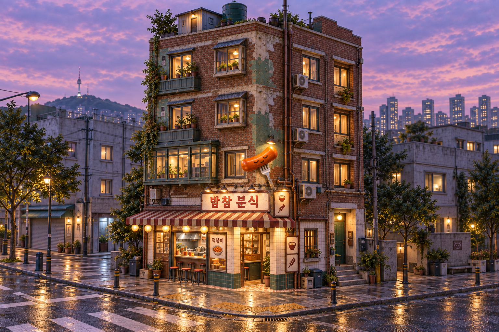
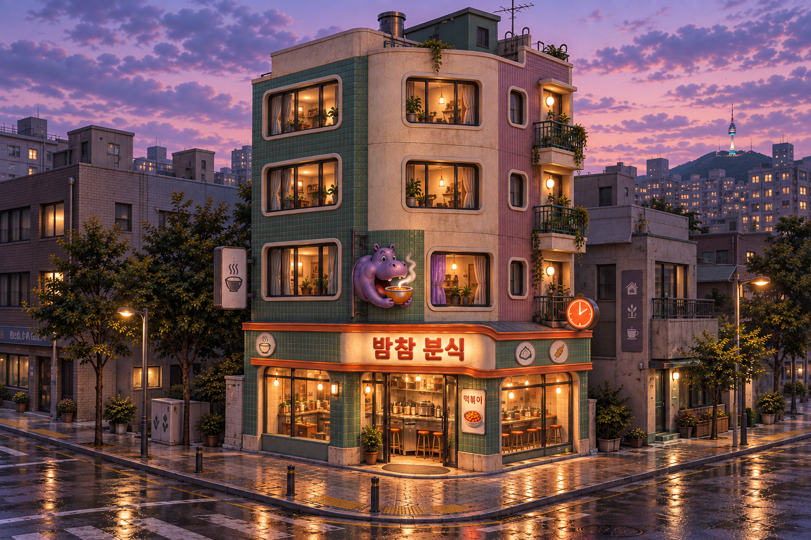
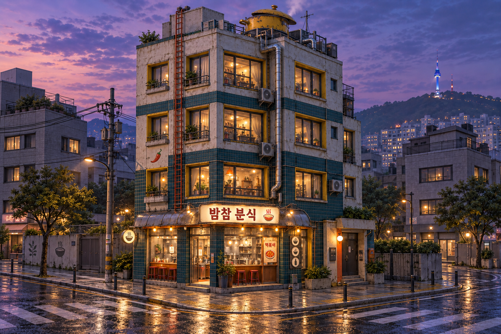

# Building and shop — concept round 01

Created 2026-09-13 with built-in ImageGen. These are concept images for art
direction, not Blender renders, playable assets or measured runtime quality.
The user requested a quirky, off-beat style and selected **A — Patchwork Pocha**
on 2026-09-13. The implemented building still needs separate visual acceptance.

All three explore a four-storey Seoul corner building: a ground-floor late-night
snack shop and three upper floors, seen at dusk after rain. Each includes a
material palette, signage, visible interior depth and an immediate street corner.
The 12 × 10 m footprint in the brief is a modeling target; image dimensions do
not establish accurate building measurements.

| Direction | Character | Main design anchors |
| --- | --- | --- |
| A — Patchwork Pocha | Handmade, accumulated, cozy | Weathered brick, jade bay, mismatched balconies, sleepy snack sign |
| B — Snackwave | Playful retro; recommended starting point | Rounded corner and windows, jade/cream/lilac, hippo sign, orange clock |
| C — Midnight Snack Lab | Oddball industrial | Teal ceramic, worn concrete, exposed ducting, cooking-pot roof vent |

## A — Patchwork Pocha

## B — Snackwave

## C — Midnight Snack Lab

## Review notes

- The final `-v2.png` files are 1536 × 1024 PNGs. Visually checked for a shop
  floor plus three upper window rows, coherent corner architecture, readable
  primary shop name, material variation and warm interior lighting.
- The original images omitted one upper storey. They remain alongside the
  final files as iteration history and are superseded by `-v2.png`.
- The primary shop name is 밤참 분식. Small secondary signage and architectural
  connections still require deliberate authoring in the 3D asset.
- The images use a relatively realistic material treatment with quirky design
  features. The user may choose stronger stylization before modeling starts.
- Initial assistant recommendation was B; the user selected A. The chosen
  concept still needs neutral-light, dry-pavement and actual game
  camera reviews; dusk and wet reflections are only one presentation condition.

## Provenance and next step

Full initial prompts: [prompts.json](prompts.json).
Single-change floor correction prompts: [floor-correction-prompts.json](floor-correction-prompts.json).
All initial images were made from text, then each final image was edited from
its corresponding initial concept. No image is evidence of an implemented model.

After the user chooses or revises a direction, build the building, shop and
corner in Blender with editable recipes, mapped materials and an exported game
asset. Deliver its PNG under `tools/blender/previews/<id>.png` and review the
actual Three.js result according to [the pilot brief](../../../../WORLD-BUILDING-PILOT.md).
