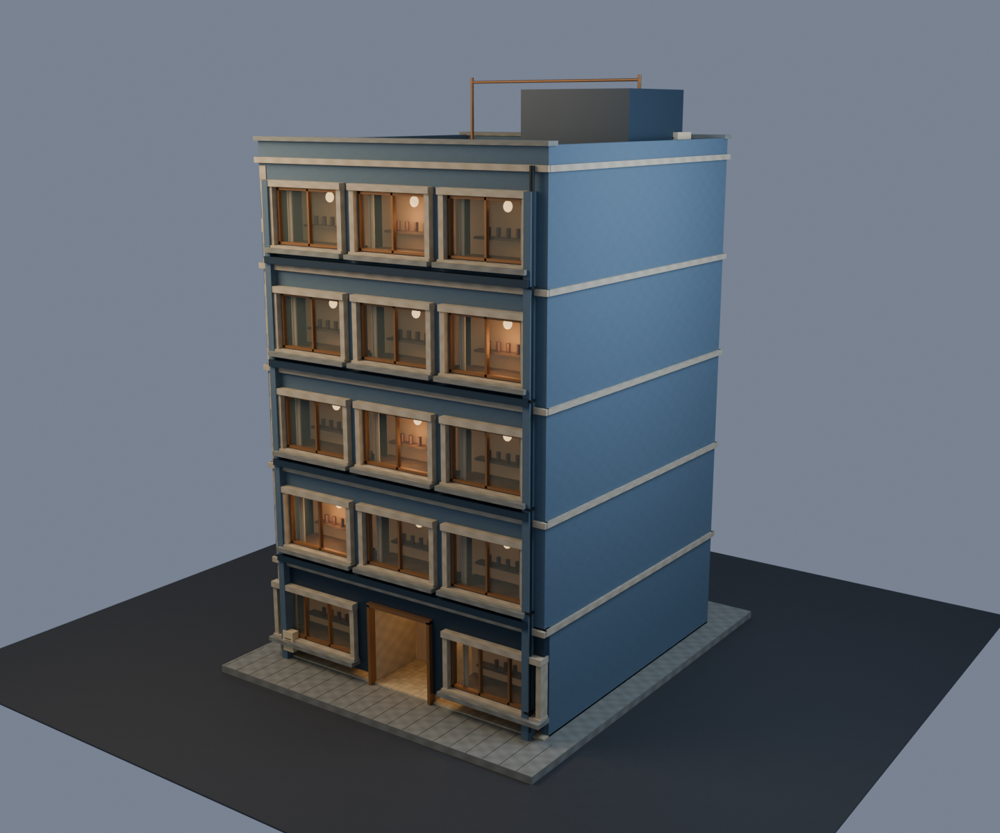

# Blue Ledger Offices — commercial kit building

Five-storey, 10 × 10 m small office. A plain double-door lobby, deep pilasters,
regular curtain-wall bays and a rooftop frame replace the snack-shop canopy and
sign language. Blue concrete, navy belts and bronze frames form a cooler palette.

Build with `npm run blender -- blue-office`; review at
`/building-pilot.html?building=blue-office`. The current runtime GLB is
3,099,768 bytes, 9,768 triangles and 15 materials. Estimated RGBA image
residency with mips is 14.3 MiB. The [coherence pass](COHERENCE-PASS.md) adds
deep window openings, room pockets, stone sills and common facade services.
Current renderer measurements are in `reports/blue-office-runtime.json`.

The Blender gate and real-game PBR/AO, drive, walk-through lobby, wall, route
and fixed-view checks pass. Editable source is
`_source-assets/world/hero-building/blue-office.blend`; runtime evidence is
under `_work/blue-office-review/`.
