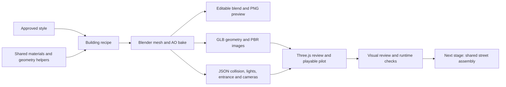

# Building kit — how it fits together

The [coherence pass](COHERENCE-PASS.md) brings the three non-retail buildings
onto the accepted Pocha's deep-window, trim and detail standard while retaining
their different uses and palettes. It also fixes shader churn from the assembly
light pool. User art acceptance of this pass remains pending.

## Current inventory

| Building | Role | Footprint | Floors | Review state |
| --- | --- | --- | --- | --- |
| Patchwork Pocha | Corner landmark, two active facades | 12 × 10 m | 4 | User accepted |
| Moon Hotteok | Narrow infill, serving hatch | 6 × 10 m | 3 | User requested continuation after delivery |
| Cloud Dumpling House | Taller mixed use, shop/studio/apartments | 8 × 10 m | 5 | Built for art review |
| Ochre Walk-up | Apartments, shared residential entry | 7 × 10 m | 4 | Built after repetition review |
| Blue Ledger Offices | Offices and ground-floor lobby | 10 × 10 m | 5 | Built after repetition review |
| Eulji Service Workshop | Repair workshop and storage | 9 × 10 m | 2 | Built after repetition review |

The original three buildings are deliberately snack-shop or mixed-use variants.
The next three answer the review that repeating shopfronts and one warm palette
did not read as a small city: residential, office and industrial ground floors
now use ochre/sage, blue/bronze and charcoal/mustard families. All six are
individually playable review assets. The combined street places two copies of
each along a 12 m road: [assembly guide and results](STREET-ASSEMBLY.md).

## Authoring to gameplay

`recipes/patchwork_pocha.py` currently contains both the first building and the
shared material, window, mesh, AO and export helpers. The other recipes import
those helpers and author their own architecture, ground-floor use and signature details.
The helper location is historical; it need not be copied for a new variant.
Each recipe runs in a fresh Blender process and saves its own named checkpoint.

`tools/blender/catalog.mjs` tells the build runner which recipe, outputs, PNG
and size/triangle gates belong to each asset. `src/world/building-catalog.js`
lists the available runtime buildings and supplies the review selector and
browser validation expectations. Register new variants in both catalogs.

Blender uses metres with Z up and the shopfront facing negative Y. Exported
GLB and metadata use Three.js Y up, front facing positive Z. A building's
`footprint` describes its architectural plot, not its larger review road slab.
The metadata supplies simple solid collision, threshold meshes, light positions,
entrance clearance and consistent camera presets alongside the visible model.

The pilot loader combines GLB and JSON with the game's existing lighting,
weather, vehicle, walking and collision systems. An attractive Blender render
is followed by actual renderer screenshots and movement checks. Full upper-floor
circulation is not implemented. The three original food buildings have playable
shop thresholds; the walk-up, office and workshop have playable shared, lobby
and pedestrian entrances respectively.

## Street assembly workflow

The first test assembly implements steps 1–4 below, entrance approach anchors,
matching-resolution texture sharing and combined validation. Denser art and
district expansion remain future work.

1. Author plot positions and rotations along an existing valid road. Put the
   Pocha on a corner and the narrower buildings between intersections. Align
   fronts to a common pavement line and preserve their different heights.
2. Separate each asset's review-only road, kerbs and pavement from the building.
   Build a continuous shared pavement and road once. Add explicit component roles
   to both render meshes and collision metadata before filtering them; blindly
   placing the current complete exports would overlap their review slabs.
3. Transform each building's collision, threshold, lights and entrance using
   the same placement as its visible geometry. Check turning space, door access,
   adjacent party walls and pavement seams together.
4. Connect selected shop entrances to delivery anchors and register restaurants
   through the game's order data. Snack Street now binds Patchwork Pocha, Moon
   Hotteok and Cloud Dumpling House by stable assembly entrance id, with a
   pilot-only roster so the default city's eight restaurants stay unchanged.
5. Measure a six-to-ten-building street at driving and walking height, including
   day/night and repeated facades. Then establish texture, draw, lighting and
   distance-detail budgets before generating a district.

## What reuse saves, and what remains

Shared authoring saves repeated code, material design and setup. Each standalone
GLB embeds its own maps and AO atlas. The assembly now instances repeated opaque
geometry and shares matching deterministic surface texture objects at equal
resolutions across different assets. AO remains specific to each building and
glass stays separately sorted. Eight practical lights are pooled. Larger scenes
still need distance detail and a measured shadow/texture/draw budget.

Keep the low-cost path: use the approved style and helpers, author a new
silhouette and ground-floor use, run one build and targeted review, and repeat only
to fix a visible or measured defect. No exact token savings have been measured.
Record actual asset size and runtime evidence in each model guide and `reports/`.

## Paperwork and completion

Every building ships its recipe, GLB, JSON metadata, editable `.blend`, required
`previews/<id>.png`, actual game preview, model guide and saved validation report.
Update this inventory, `README.md`, `handoff.md` and `WORLD-BUILDING-PILOT.md` with
the real review state. Keep portable implementation facts in
`TRUTHS_SEOUL-SNACK-ATTACK.md`. Automated passes are not user art acceptance.
