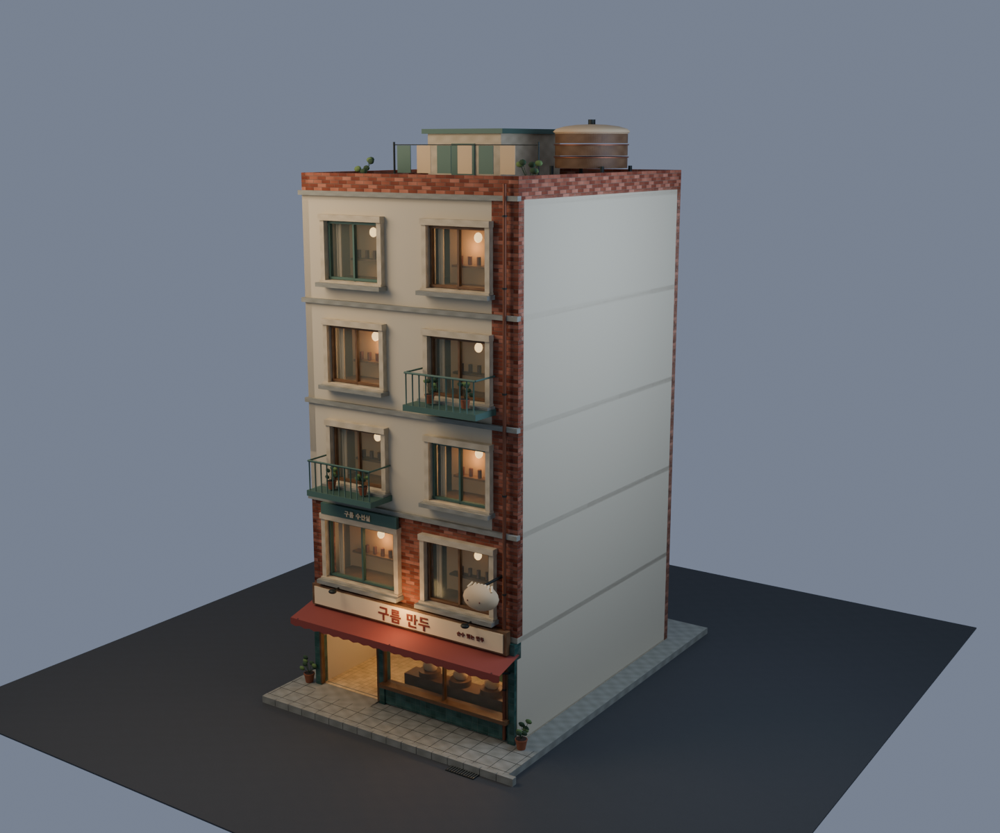
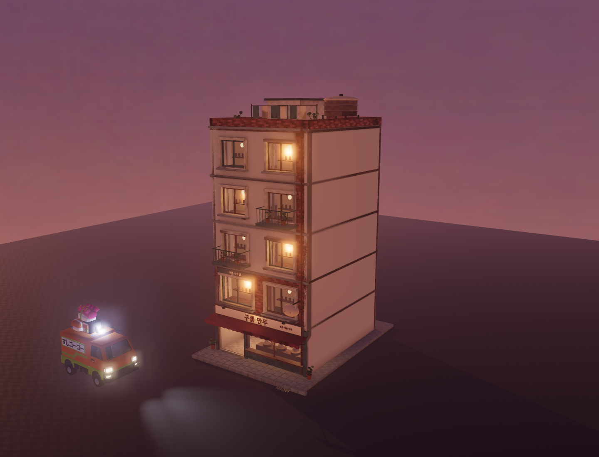

# Cloud Dumpling House — tall mixed-use variant

Third building, made after the user requested the next variant, current paperwork
and an explanation of how the kit fits together. User art review is pending.

## Design

Five storeys on an 8 × 10 m plot. Ground-floor dumpling shop, second-floor
repair-studio frontage and three apartment floors. Cream upper walls, a brick
edge, alternating balconies, oxblood scalloped canopy, original folded-dumpling
sign, rooftop laundry and a steamer-shaped water-tank enclosure distinguish it
from the first two buildings. Blank side party walls suit neighbouring infill.

The shop has a walkable entrance, threshold ramp, glazed display, steamers,
dumplings, prep counter, stools and product shelves. Upper windows are furnished
room pockets; full apartment/studio interiors and stairs are not implemented.

## Rebuild and review

`npm run blender -- cloud-dumpling` runs `recipes/cloud_dumpling.py`. It imports
the existing Patchwork material, window, geometry, AO and export helpers. No
ImageGen or new MCP setup was needed. Texture dimensions use the Moon Hotteok
half-size setting and a 1024-pixel AO atlas.

- Review: `/building-pilot.html?building=cloud-dumpling` (current server port 5287).
- Play: `/?world=pilot&building=cloud-dumpling&intro=off`.
- Editable source: `_source-assets/world/hero-building/cloud-dumpling.blend`.
- Runtime: `public/assets/world/cloud-dumpling.glb` and `.json`.
- Required render: `tools/blender/previews/cloud-dumpling.png`.

The shared selector lists all three variants. The default city and restaurant
order data do not yet include this building. See [the kit guide](BUILDING-KIT.md)
for authoring connections and the planned street assembly stage.

## Validation and measured cost

| Measure | Result |
| --- | ---: |
| GLB triangles | 28,956 |
| Materials | 25 |
| GLB bytes | 5,617,808 |
| Embedded images | 22 |
| Estimated RGBA image memory including mips | 21.3 MiB |
| Draws including shadows and post | 123 |
| Median GPU render time | 6.44 ms |

One isolated Chrome/RTX 4060 measurement at 1440 × 1100; GPU max 7.68 ms.
These figures do not establish a populated-street or phone budget. Image memory
matches Moon Hotteok and is 75% below Patchwork Pocha's estimate. No exact model
token saving was measured.

Passed: seven imported PBR map sets, 24 materials with independent-UV AO,
transparent glazing, day/dusk/night captures, real game boot and driving,
F-to-exit, capsule movement through the entrance, solid wall collision and route
lookup. No runtime/renderer errors. Blender asset gate (nine recipes), encoding
check and production build passed. Saved evidence:
`reports/cloud-dumpling-runtime.json` and `reports/cloud-dumpling-asset.json`.

Recheck with `SNACK_TEST_URL` pointing to the dev server and
`BUILDING_PILOT=cloud-dumpling`, then run
`node tools/bench/building-pilot-check.mjs`. Refresh measurements using
`node tools/bench/building-pilot-metrics.mjs cloud-dumpling`.
