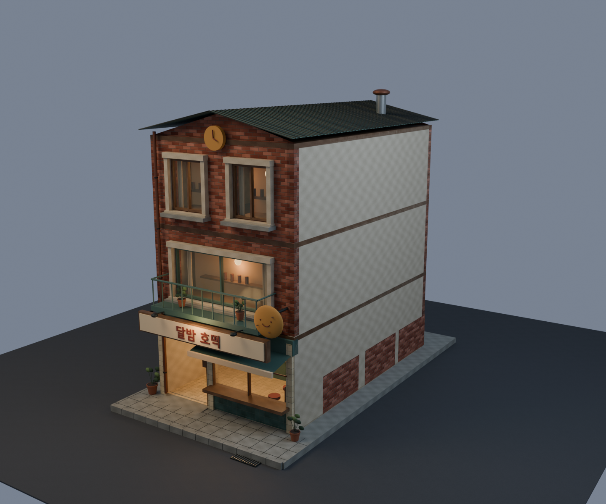
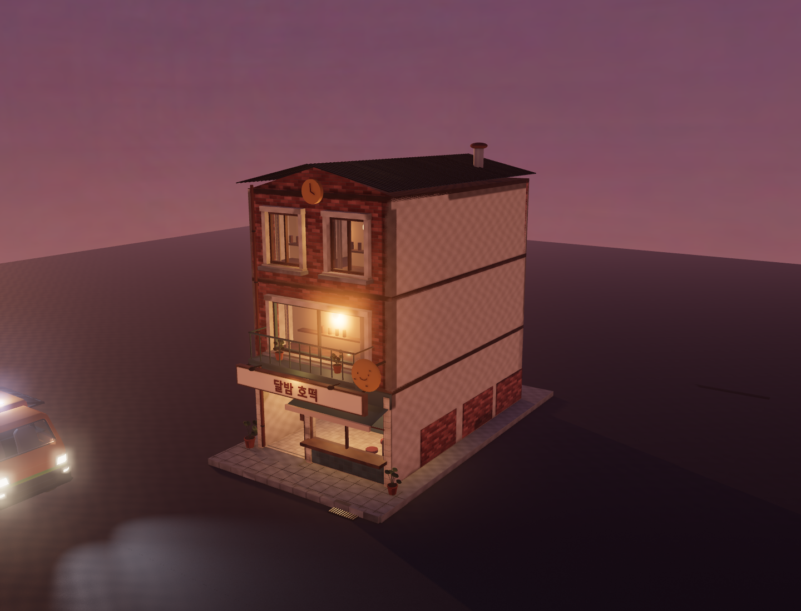

# Moon Hotteok — narrow shop variant

Built after the user accepted Patchwork Pocha and requested the next building
cost effectively. After delivery, the user requested the next building and
up-to-date paperwork; Moon Hotteok is the retained second kit variant.

## Design and review

A 6 × 10 m, three-storey shop: weathered brick, green pitched metal roof,
balcony, pancake clock and smiling pancake sign, serving hatch, furnished
kitchen, warm shop lighting, rear service door and a shallow entrance ramp.
Side party walls are deliberately mostly blank for adjoining buildings.

Open `/building-pilot.html?building=moon-hotteok` on the dev server (current
review port 5287). The building selector also returns to Patchwork Pocha.
**Drive & walk here** carries the selected building into the real game.
This isolated pilot is not yet a delivery restaurant in the default city.

## Reuse and rebuilding

`npm run blender -- moon-hotteok` runs `recipes/moon_hotteok.py`, importing the
approved material, window and mesh helpers from `recipes/patchwork_pocha.py`.
Both use the same AO baking, export, collision metadata and preview pipeline.
The first recipe's default resolutions and building geometry are preserved.
The narrower shop uses half-size texture dimensions and a 1024-pixel AO atlas.
No new concept images were generated.

Outputs: `public/assets/world/moon-hotteok.glb` and `.json`, this guide's PNGs,
and `_source-assets/world/hero-building/moon-hotteok.blend` (editable source).

## Measured result

| Measure | Moon Hotteok |
| --- | ---: |
| Triangles | 21,170 |
| Materials | 25 |
| GLB bytes | 5,105,876 |
| Embedded images | 22 |
| Estimated RGBA image memory with mips | 21.3 MiB |
| Draws including shadows/post | 121 |
| Median GPU render time | 3.03 ms |

Image memory is 75% lower than Patchwork Pocha's 85.3 MiB estimate. GPU timing
is an isolated Chrome/RTX 4060 run at 1440 × 1100, not a populated street or
phone measurement. Lower runtime asset cost is separate from model token cost;
reuse reduced repeated authoring work, but no exact token saving was measured.

Validation passed: imported PBR maps and independent AO UVs, transparent glass,
day/dusk/night images, real game boot and driving, F-to-exit, full character
capsule entering the shop, solid wall collision, and route lookup. Blender gate
(eight assets), UTF-8 check and Vite production build also passed. Saved evidence:
`reports/moon-hotteok-runtime.json` and `reports/moon-hotteok-asset.json`.

Repeat the targeted browser check with `SNACK_TEST_URL` pointing to the local
server and `BUILDING_PILOT=moon-hotteok`, then run
`node tools/bench/building-pilot-check.mjs`. Refresh asset measurements with
`node tools/bench/building-pilot-metrics.mjs moon-hotteok`.
