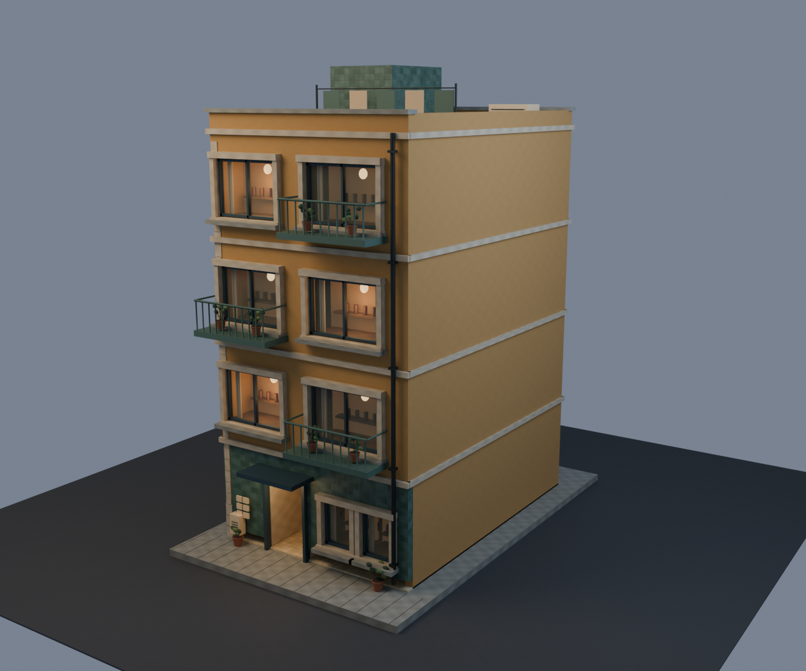

# Ochre Walk-up — residential kit building

Four-storey, 7 × 10 m apartment walk-up. Its ground floor is a recessed shared
entry with mailboxes, a weather canopy and paired domestic windows—no shop,
serving hatch, menu, or retail sign. Ochre render, sage tile and navy metalwork
deliberately leave the original brick/jade shop palette.

Build with `npm run blender -- ochre-walkup`; review at
`/building-pilot.html?building=ochre-walkup`. The current runtime GLB is
4,016,660 bytes, 11,542 triangles and 21 materials. Estimated RGBA image
residency with mips is 18.3 MiB. The [coherence pass](COHERENCE-PASS.md) adds the
Pocha window/room kit, masonry openings, facade services and clean shell joins.
Current renderer measurements are in `reports/ochre-walkup-runtime.json`.

The Blender gate and real-game PBR/AO, drive, walk-through entrance, wall,
route and fixed-view checks pass. Editable source is
`_source-assets/world/hero-building/ochre-walkup.blend`; runtime evidence is
under `_work/ochre-walkup-review/`.
