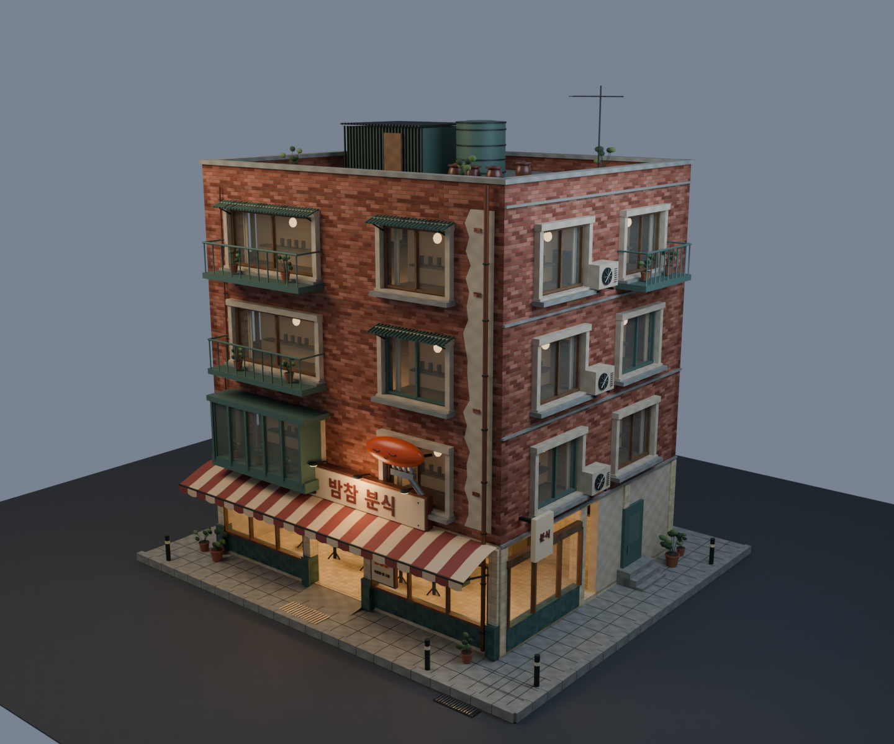
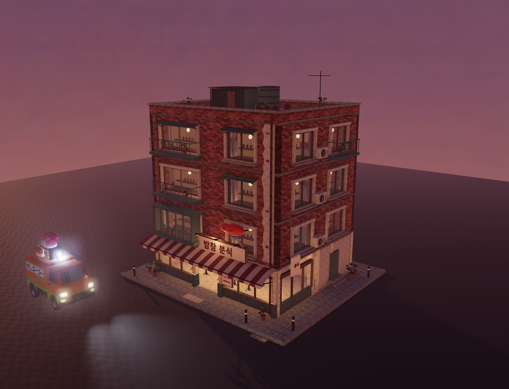

# Patchwork Pocha — first playable building

The user selected direction A on 2026-09-13: wonky renovations, weathered
brick and handmade warmth. The editable model and exported game pilot are
accepted by the user on 2026-09-13: “this building looks great, run the next one.”
Moon Hotteok is the next narrow shop, built from the same material and geometry helpers.

## Review

Run the normal dev server and open `/building-pilot.html`. Drag to orbit, scroll
to zoom, and compare the six camera presets, four lighting phases and wet/dry
road. **Drive & walk here** opens `?world=pilot&intro=off&time=dusk&rain=off&props=off`
with the real game vehicle, walking controller, collision and post-processing.
The current task's review server uses port **5287**; the normal dev port is 5273.

**Blender World Studio.cmd** opens the saved authoring scene. Both the studio
and `_source-assets/world/hero-building/patchwork-pocha.blend` contain the model.





## Contents

- Four storeys on a 12 × 10 m footprint, with window openings and room pockets
  on all sides, projected bay, balconies, rain hoods and supported service gear.
- Ground-floor shop with cooking pots, shelves, bowls, stools, counter, tiles,
  clear glazing, warm lamps and an open entrance with a shallow threshold ramp.
- Striped cloth canopy, extruded Hangul, original sleepy snack-on-fork sign,
  plaster repair, copper pipes, AC fans, roof shed/tank/antenna and planters.
- Street corner with sidewalk, curb, drain and tactile pavers.
- Seven deterministic PBR texture sets plus an independent UV2 contact-shadow
  atlas, light-placement metadata and separate collision boxes/threshold mesh.

The original [selected concept](../art/hero-building/round-01/a-patchwork-pocha-v2.png)
is ImageGen art. These previews above show the implemented 3D asset. The
concept's surrounding city, reflections and full scene dressing are not part
of this one-building pilot. The primary sign is authored as geometry; secondary
signage was deliberately typeset rather than copied from generated pixels.

## Build and validation

```powershell
npm run blender -- patchwork-pocha
node tools/bench/blender-check.mjs
node tools/bench/building-pilot-metrics.mjs
$env:SNACK_TEST_URL='http://127.0.0.1:5273/'
node tools/bench/building-pilot-check.mjs
```

The recipe uses Blender 5.2 and Windows' installed Malgun Gothic Bold for
Hangul. No font file ships in the GLB. The recipe rebuilds maps, geometry,
contact-shadow atlas, source checkpoint, GLB, metadata and required PNG.

Validated on 2026-09-13 in Chrome on this machine's RTX 4060:

| Measurement | Result |
| --- | --- |
| Exported geometry, including street corner | 52,750 triangles |
| Materials / encoded PNG images | 26 / 22 |
| GLB | 20,251,960 bytes |
| Estimated image residency, RGBA8 with mipmaps | 85.3 MiB |
| Review meshes, including driving apron | 64 |
| Draw calls including shadow and post-processing passes | 143 |
| GPU frame time, 1440 × 1100 fixed review view, 12 samples | 6.59 ms median / 7.95 ms maximum |
| CPU render submission time | 1.5 ms median |

The pilot uses one 2048px directional shadow, seven local point lights and
4-sample antialiasing on the post-processing targets. These settings apply to
the pilot in both the review page and game. The main city's settings stay as-is.
Texture residency is an estimate of the asset images, not total GPU memory.
The timing covers this isolated review scene, not a full city or physical phone.
Shared texture reuse, compression, fewer material groups and LOD decisions
remain work for the variant/street stage after visual acceptance.

Passed: GLB geometry/size/preview gate; seven full material sets and transparent
glass after import; independent UV2 occlusion on 25 materials; real game boot,
finite vehicle physics, driving, F-to-exit, route lookup, solid wall ray and
full player capsule crossing the shop threshold. Fixed captures cover front,
corner, side, walking, driving and shop views across day/morning/dusk/night
and wet/dry pavement. No captured runtime/renderer errors. Production build and
UTF-8 check passed. Reports are in `reports/`; captures are in
`_work/patchwork-review/`.

The upper-floor side door is architectural dressing; upper rooms are window
interiors. This is a freely explorable shop pilot, not yet a newly registered
delivery restaurant. Do not expand or replace the city until the user accepts
the actual look and the larger-scale budget has been measured.
