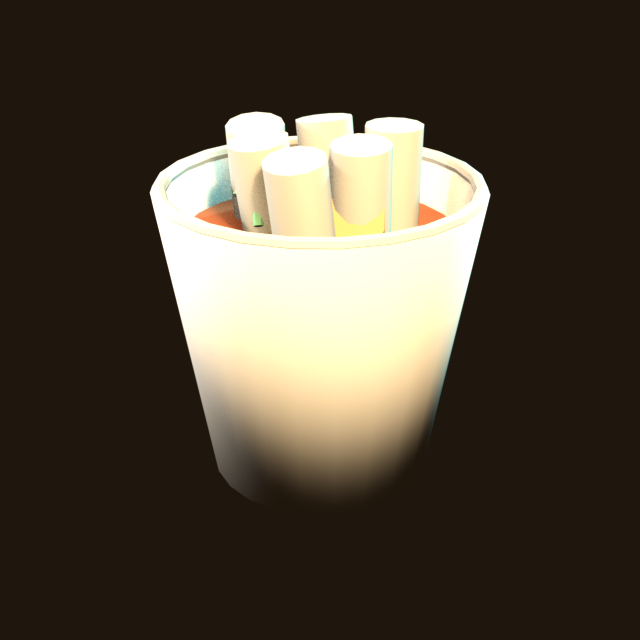
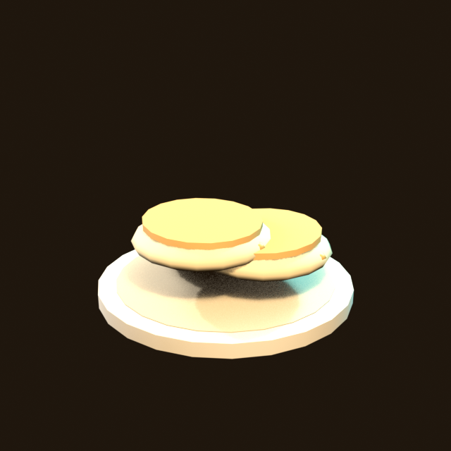
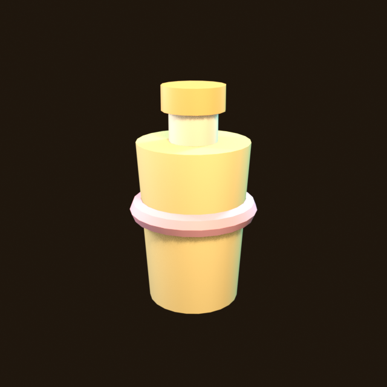
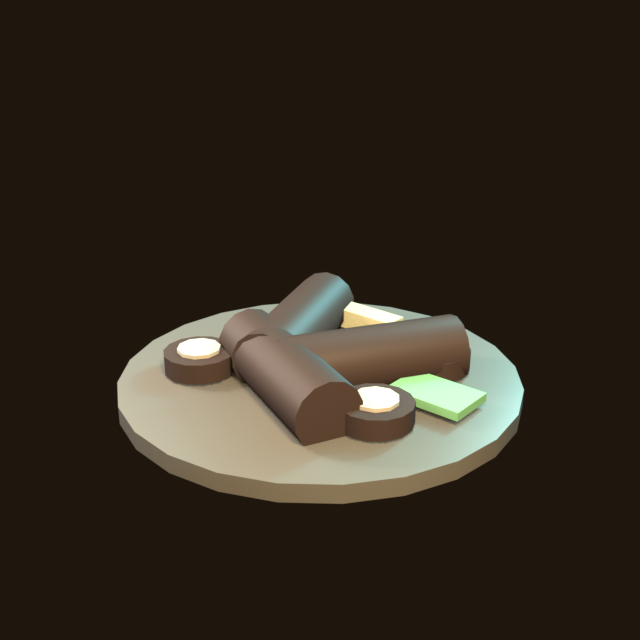
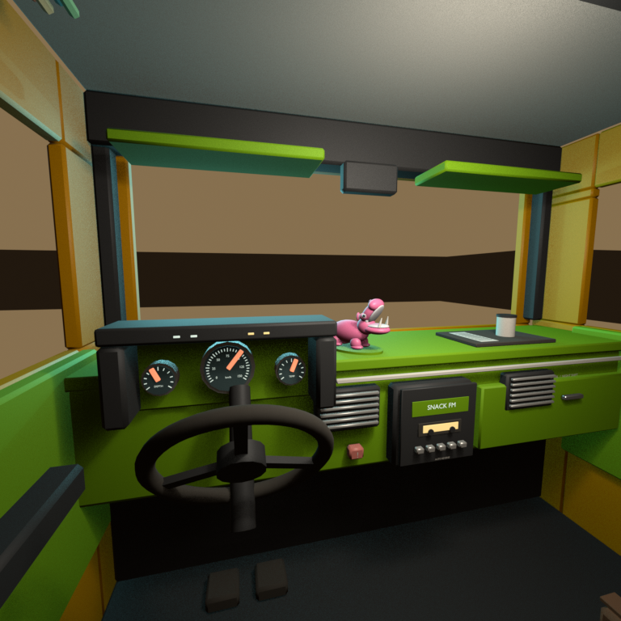
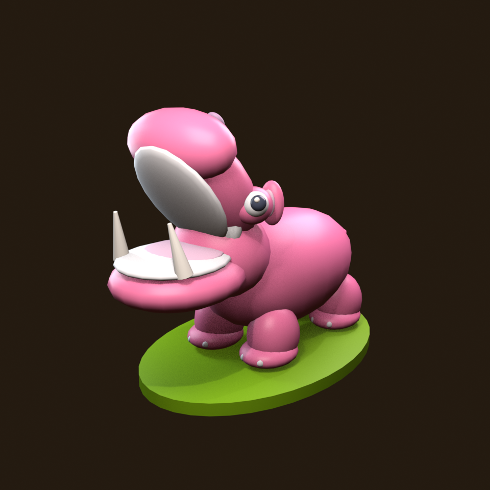

# Headless Blender — custom assets from scratch

This is the living process. Every time a recipe teaches us something, add it
to **Lessons** at the bottom. The Python file is the source of truth; the GLB
is a build product.

Blender on this machine: **5.2.1 LTS** at
`C:/Program Files/Blender Foundation/Blender 5.2/blender.exe`.
Override with `BLENDER` or `BLENDER_PATH`.

## Why this exists

The shipped food catalog is mostly Sketchfab dumps. They work because
`food-display.js` normalises largest-dimension to 1 m at runtime, but they
are expensive and dishonest:

| asset | tris | world size | notes |
|---|---:|---|---|
| `jin-ramen-cup.glb` | 13 272 | ~15 cm | usable |
| `gochujang.glb` | 2 014 | **170 units** | runtime scale saves it |
| `dakggochi.glb` | **165 097** | metres of KakaoTalk photo planes | do not copy this pattern |
| `tteokbokki-cup.glb` (ours) | 1 168 | 11.3 cm | recipe in this folder |
| `hotteok.glb` (ours) | 1 660 | 14.4 cm | recipe in this folder |

A 12 cm snack with named Principled materials is cheaper to iterate than a
165 k-tri scene graph of somebody's camera roll.

## Previews (required)

Every model has a PNG. No PNG means the recipe is not done. Look here
before opening Blender or the game:

| id | preview |
|---|---|
| `tteokbokki-cup` |  |
| `hotteok` |  |
| `banana-milk` |  |
| `soondae-platter` |  |
| `pocha-interior` |  |
| `dash-hippo` |  |

The interior ships four stills, because one frame cannot answer "is the whole
cab right?": [`-cabin`](previews/pocha-interior-cabin.png) (wide),
[`-galley`](previews/pocha-interior-galley.png) (the serving side) and
[`-cluster`](previews/pocha-interior-cluster.png) (dials). The catalog gates
only the first — the driver's eye, which is literally the player's view.

## Commands

```bash
npm run blender                 # every recipe → GLB + preview PNG
npm run blender -- tteokbokki-cup
npm run blender -- --list
node tools/blender/inspect.mjs public/assets/food/tteokbokki-cup.glb
npm run blender-check           # GLB budgets, no Blender required
```

`npm run blender` also copies into `public/assets/food/` so the running game
picks the file up. `npm run food` still copies from `_source-assets/food/`
the same way as the inherited catalog.

## Add a snack (the cheap path)

1. Copy `recipes/hotteok.py` — it is the simpler of the two.
2. Register it in `catalog.mjs` (`script`, `out`, `public`, `preview`,
   `kind: 'food'`, `budgetTris`, `minM` / `maxM`).
3. Model in **metres**. Origin will be snapped to ground-centre by
   `origin_to_ground_center`.
4. Colour from `lib.BIBLE` (mirrors `src/world/data/color-bible.js`). A
   fourth hue is a local snack colour, never a new HUD accent.
5. Principled BSDF only — Base Color / Roughness / Metallic / Specular IOR
   Level. Mystery node trees do not survive Khronos glTF export.
6. `npm run blender -- <id>` — this **must** write `tools/blender/previews/<id>.png`.
   A GLB without a PNG is a failed build (`run.mjs` and `blender-check` both
   refuse it).
7. Look at that PNG **before** you trust the GLB.
   The first tteokbokki pass exported correct red sauce and still rendered
   as a white cup of marshmallows: the cone still had its paper lid.
8. `node tools/blender/inspect.mjs public/assets/food/<id>.glb`
   — floor y ≈ 0, largest dimension in the catalog's min/max, named materials,
   0 cameras.
9. Wire `src/game/food-display.js` (`MODEL_SPECS`) and the dish `models:`
   array in `src/game/data/restaurants.js`.
10. Probe: `?intro=off&offer=1&accept=1&restaurant=<shopId>`

Do not run `optimize.mjs` on these. They have no textures; meshopt is a
later option if a recipe grows past a few thousand tris.

## Conventions the game actually cares about

- **Units:** metres. Food is authored at real-ish street-stall size
  (8–15 cm). The runtime still normalises largest dim → 1 m, then draws
  it at 0.9 m (solo) / 0.64 m (combo), so silhouette and colour read more
  than millimetres.
- **Axes:** Blender Z-up. Export with `export_yup=True` (glTF / three.js
  Y-up). Vehicles are a different contract (`normalize-vehicle.mjs`, +Z
  forward) — do not use this food pipeline for a drivable rig.
- **Origin:** bbox centre in XZ, bbox floor on Y=0. Hover height is the
  wrapper's job, not the mesh's.
- **Join by object, keep materials.** One node, several primitives, named
  slots. Inspect must list every intended material, not a single
  `Material`.
- **`--factory-startup`.** A local add-on must not change topology.
- **No cameras/lights in the GLB.** The preview studio is built *after*
  export, and `export_cameras=False` / `export_lights=False` are belt and
  braces.
- **PNG preview is mandatory.** `tools/blender/previews/<id>.png`, committed,
  shown when reporting the model. The human asked for this so they can see
  the asset without opening Blender.

## Layout

```
tools/blender/
  README.md            this file
  lib.py               reset, bible hexes, Principled, export, preview
  catalog.mjs          recipe registry
  find-blender.mjs
  run.mjs
  inspect.mjs
  recipes/*.py         one file per asset
  previews/*.png       EEVEE stills, committed on purpose
```

## Not food: vehicle interiors

`pocha-interior` is the first recipe that is not a snack, and it bends three
food conventions on purpose:

- **It does not join to one object.** `steering_wheel`, `needle_speed` and
  `needle_fuel` ship as their own glTF nodes so the runtime can drive them.
  `ground_center_group(objects, keep_transform=[...])` grounds the set while
  those three keep their own origin and rotation; everything else is baked and
  joined into `pocha_interior`.
- **It is emissive.** `principled(..., emission_hex=, emission_strength=)`
  carries screens, the dome lamp and the galley neon out as `emissiveFactor`.
- **It brings its own studio.** `render_preview(..., lens=, lights=,
  world_strength=, res=, clip_start=)` — the snack three-point does not reach a
  3.4 m subject, and a camera inside its subject needs a near clip.

Origin contract: y=0 is the floor-pan underside, the standing floor is 0.05 m
up, and the driver's eye point is glTF `(x +0.55, y 1.24, z -0.42)` — +X left,
+Z forward, matching `pocha.json`'s `leftAxis`.

## Lessons

Record the failure, not the mood. Newest first.

### 2026-09-12 — cab finish and Blender hippo

- The cab is 19,200 triangles (30,000 budget). One-segment bevels on the small
  fittings leave room for dial ticks/numbers, stereo controls, seat stitching,
  cabinet reveals, tiles, an open sink and galley clutter. Larger dash edges
  retain two bevel segments. The wheel sits lower so the instrument faces read.
- `dash_hippo.py` builds the reference's yawning lilac souvenir as two nodes:
  `hippo_body` and `hippo_head`, 21,140 triangles together. Metres, +Z forward
  after glTF export, origin at the plinth bottom. `dash-hippo.js` only animates
  the preserved head pivot; it no longer generates geometry.
- The cab preview adds the separate hippo **after export**, in the same pose
  as `vehicles.js`; the runtime loads the separate GLB. Rebuild the hippo first
  when changing both. Its standalone PNG is required by the catalog too.
- Build transformed ellipsoids with an explicit `Matrix.LocRotScale` when
  applying a parent matrix. Reading `matrix_world` immediately after changing
  scale can still see Blender's old transform and export metre-wide toy parts.
- The runner passes `--python-exit-code 1`. Blender otherwise exits zero after
  a Python exception, which could let an old preview disguise a failed build.

### 2026-09-10 — pocha truck interior

- **Every "missing" part was a solid box eating it.** Three times in one
  recipe: the binnacle swallowed all three dials, then the 0.46 m dash slab
  swallowed the whole cluster, then the solid bezel cap hid its own dial face
  with the needle sealed inside. This is the lidded-cup lesson at cabin scale.
  Anything mounted *on* a surface has to sit **proud of** it — model the hood,
  not the block, and check the stacking order front to back.
- **A cockpit is judged from the eye point, not from orbit.** The hero still is
  the driver's seat at 18 mm. It is also the only view that catches the faults
  above: the dials were "there" in the file and invisible to the player for two
  passes, once behind a hood roof and once behind the wheel's spoke half. Real
  dashes put the cluster *above* the wheel's rim; ours had to drop the wheel to
  0.93 m and lift the pod to 1.00 m before it read.
- **Interiors are lit from inside.** Pass 1 aimed a 900 W key at the cab from
  outside and rendered a cream box with no orange left in it. Put the lights
  where the fixtures are — dome lamp, galley neon — and let street spill through
  the windscreen do the modelling. 11-17 W in a 2 m room, not hundreds.
- **`Standard` has no highlight rolloff, so emission over ~1.5 clips to white.**
  The dome at 4.5 and the neon at 3.2 both rendered as featureless white slabs.
  Colour survives at 1.0-1.5; that is the whole usable range for this transform.
- **A window with a black world reads as a wall.** A render-only backdrop, built
  *after* `export_glb`, is what proves the openings are openings. Build it after
  the export and it can never leak into the GLB.
- **`use_renderable=True` means `hide_render` excludes geometry from the
  export.** So a hidden-wall cutaway cannot be done between build and export —
  and after the join those panels are not separate objects anyway. Interior
  camera angles answer the same question without the trap.
- **Booleans are not needed to punch a window.** Slicing the panel on its holes'
  own edges (`rect_cells`) gives the same silhouette out of plain boxes, with no
  manifold requirements and no renumbering.
- **`join()` still only renames the object.** The `keep_transform` path skipped
  `obj.data.name = obj.name` and the wheel exported as `Torus`. Same trap as the
  first two snacks, one branch further in.

### 2026-08-27 — first two snacks (Ryan)

- **Preview lights are for a 12 cm subject.** Key energy 40 (a character
  three-point) blew every bible hex to white. The GLB was already correct
  (`gochujang_sauce` baseColorFactor `[1, 0.302, 0.149, 1]`). Energy ~4 / 1.4
  / 2.2 and `view_transform = Standard` (not AgX/Filmic) made the still
  match the file.
- **A filled cone is a lidded cup.** `end_fill_type='NGON'` + solidify left
  a paper cap over the sauce. Use `fill='NOTHING'` and a separate bottom
  disk. Confirm in the preview that you can *see into* the cup.
- **Join renames the object, not the mesh datablock.** Pass 1 exported as
  primitive `Cone`. `origin_to_ground_center` now copies `obj.data.name =
  obj.name`.
- **Dump Principled input names when Blender jumps a major.** 5.2 still
  has `Base Color` / `Specular IOR Level`; do not assume 6.x will.
- **Inspect materials, not the PNG, when the still looks wrong.** First
  debug step is `baseColorFactor` via gltf-transform. If the factor is
  right, the bug is the studio, not the recipe.
- **The HUD thumbnail is a side-on of the GLB.** Sauce inside a cup
  disappears there. Give the silhouette a readable profile (rim, stacked
  pancakes) even if the hero view is top-down. Probe with
  `?intro=off&offer=1&accept=1&restaurant=<id>` and read
  `food display: <id> loaded on demand` — `?shop=` frames the pickup but
  can stare straight into a neon sign.

Next assets that would pay rent: banana-milk carton (bible money gold),
an actual soondae platter (the tteokbokki shop still uses luncheon-meat),
gilgeori toast. Same recipe shape.
