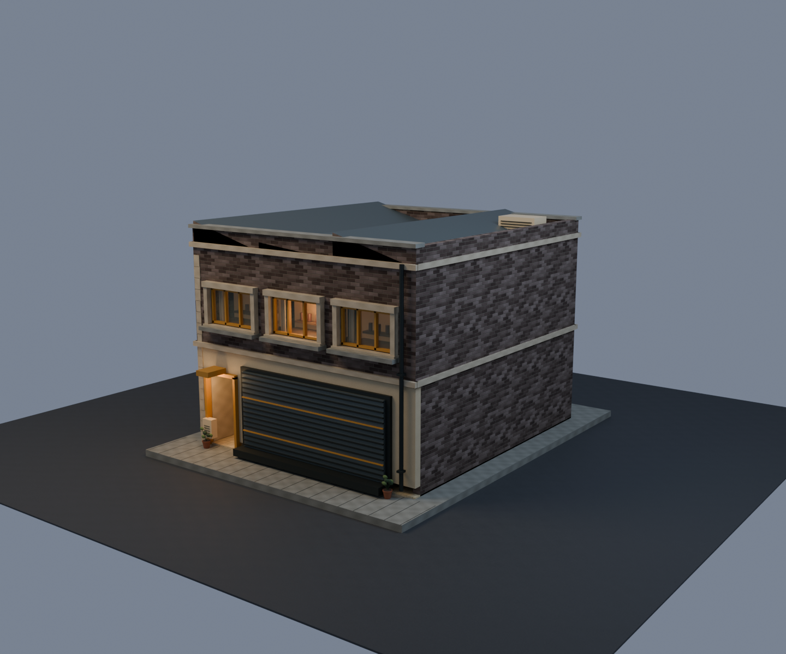

# Eulji Service Workshop — industrial kit building

Two-storey, 9 × 10 m repair/storage building. Its street level is a closed
corrugated loading shutter with a separate pedestrian entrance and loading
bumper—not a glazed customer shop. Charcoal brick, cream render, mustard trim
and a low saw-tooth roof give it a distinct industrial silhouette.

Build with `npm run blender -- service-workshop`; review at
`/building-pilot.html?building=service-workshop`. The current runtime GLB is
3,385,512 bytes, 4,123 triangles and 21 materials. Estimated RGBA image
residency with mips is 18.3 MiB. The [coherence pass](COHERENCE-PASS.md) adds
deep upper windows, common services and trim, and repairs the roof planes.
Current renderer measurements are in `reports/service-workshop-runtime.json`.

The Blender gate and real-game PBR/AO, drive, walk-through side entrance, wall,
route and fixed-view checks pass. Editable source is
`_source-assets/world/hero-building/service-workshop.blend`; runtime evidence is
under `_work/service-workshop-review/`.
