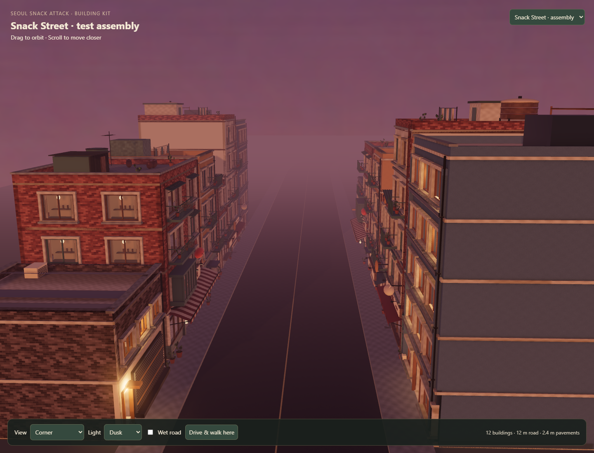

# Snack Street — first assembled driving test

Latest: [building coherence and startup pass](COHERENCE-PASS.md). The current
asset and runtime reports supersede the historical rendering counts below.
Road dimensions and the full-speed test route are unchanged.

The user requested a test assembly with streets a little wider, still compact,
and enough clearance for top-speed driving. After reviewing the first version,
the user correctly noted that twelve copies of three similarly coloured shops
read as one repeated building rather than a small city. The revised block keeps
the three food buildings and adds a residential walk-up, office and service
workshop, placed as twelve instances around one continuous street.

## Play and dimensions

Open `/?world=pilot&building=street-assembly&intro=off&time=dusk&rain=off&props=off`
on the dev server (port 5273). Normal driving and walking controls apply.
The review is `/building-pilot.html?building=street-assembly`; select **Drive &
walk here** to play. The default city remains unchanged.

Patchwork Pocha, Moon Hotteok and Cloud Dumpling House are the playable pilot
roster. Press **E** to accept, stop in the pink entrance marker for three seconds,
then carry the food to the named cyan destination shop. Each shop has two dishes
using the existing on-demand food catalog. Pickup and destination markers are
bound to the same transformed entrance records as visible geometry and collision.

- Carriageway: **12 m**, 20% wider than the existing 10 m street baseline.
- Pavements: **2.4 m** each; opposing frontages are **16.8 m** apart.
- Twelve buildings: two instances of each of six models, arranged in two rows.
- Ground-floor mix: three food shops/mixed-use buildings, apartments, offices
  and a service workshop; only the food buildings use retail shopfront language.
- Two 200 m straights and broad **140 m radius** return bends form a roughly
  1.28 km closed test loop. The art block occupies only part of one straight;
  the rest is an intentionally undressed acceleration and handling route.

The bend radius is a test of full-speed handling, not a promise that future
urban junctions can be taken flat out. Street width and bend radius are separate
design decisions. No vehicle tuning, collision bypass or gameplay steering
assist was introduced.

## How it is assembled

`src/world/building-assembly.js` loads each of the six GLBs once. An explicit
compatibility manifest identifies their review-only Street meshes and slab
colliders. It removes 22 source render groups and 24 placed slab colliders,
then creates a single continuous road, raised pavement and matching curb faces.
The individual building GLBs and Blender previews remain intact.

Placement applies the same transform to geometry, collision, threshold meshes,
lights and entrances. Current rotations are only 0 and 180 degrees, so box
extents remain valid; arbitrary rotations would require transformed collision
geometry. Each of twelve entrances has a road approach anchor. Three selected
food-building entrances are registered as a separate pilot roster; the other
nine anchors remain available for walking and collision review but do not emit
orders.

Repeated opaque parts use 200 InstancedMeshes for 400 part instances. Glass
keeps separate objects for distance sorting. Matching deterministic surface maps
at matching resolutions share texture objects across assets; the first pilot's
higher-resolution maps stay distinct. Per-building AO stays distinct. The
loader reused 76 material texture-slot references; this is not a count of 76
unique image files or an exact VRAM-saving measurement. Eight nearby practical
lights serve the block; a single bounded shadow map covers its central section.

## Driving evidence

`tools/bench/building-assembly-check.mjs` uses the actual VehiclePhysics class,
Pocha rig and current vehicle parameters against the assembled BVH. It runs at
1/120-second physics steps. The configured engine cutoff is 100.8 km/h; steady
full-throttle speed is slightly lower because of drag and rolling resistance.

| Test | Result |
| --- | --- |
| Twelve straight runs: both directions, dry/wet, lane offsets ±0.6 m | Zero collisions; minimum speed 98.38 km/h |
| Dry full-throttle loop, 48 seconds | 1,303.5 m; minimum 97.39 km/h; zero collisions |
| Wet full-throttle loop, 48 seconds | 1,300.2 m; minimum 96.88 km/h; zero collisions |
| Minimum swept body-to-kerb clearance, dry / wet | 2.98 m / 1.72 m |
| Maximum body tilt, dry / wet | 4.58° / 4.46° |
| Full character capsule through transformed building entrances | 12 / 12 pass |
| Actual game boot and keyboard driving | Pass |

The speed-envelope runs start at configured top speed after suspension settles.
The loop uses a steering benchmark driver with continuous full throttle and no
teleports during a lap. Its clearance calculation includes truck width, length
and yaw relative to the road, rather than testing only the centre point. This
establishes a navigable high-speed path; arbitrary player steering is not covered.

## Rendering and validation

Chrome / RTX 4060, 1440 × 1100, dusk corner view: **453 draws including shadows
and post**, 5.64 ms median GPU (7.59 ms max), 3.2 ms median CPU submission,
226 geometry buffers and 84 renderer textures. These are isolated measurements,
not a populated-city or phone performance guarantee. More buildings, traffic,
street props and lights require another combined budget.

Day, dusk and night captures were inspected. Browser checks, production build
and encoding check passed. Saved evidence: `reports/street-assembly-runtime.json`.
Temporary full-size captures live under `_work/street-assembly-review/`.

Re-run with `SNACK_TEST_URL` set to the local server, then
`node tools/bench/building-assembly-check.mjs`. The first generation of the loop
used a 110 m radius; measured wet clearance of 0.39 m led to the final 140 m
radius without widening the carriageway further.

`npm run snack-street-check` is the delivery gate. It opens the real game in an
isolated browser, verifies the three roster/asset/entrance bindings, routes a
forced order from every shop, and completes all three through the normal pickup
and drop-off dwell states. The current named legs are 14.8–16.6 m.

Next art decisions: user review of the corrected use/palette mix, asymmetric placements,
street furniture kept outside the driving envelope, and a denser short block.
The return loop is test infrastructure rather than finished district design.
